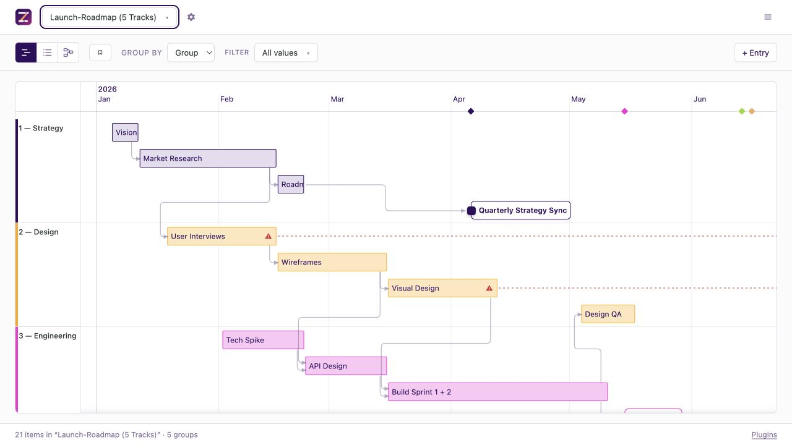

<p align="center">
  
</p>

<h1 align="center">Zeitlines</h1>

<p align="center">
  <strong>Open-source timelines for data you already own.</strong>
</p>

<p align="center">
  Turn JSON, Markdown, or Postgres into interactive timelines, structured lists,
  and specialized plugin views. Run locally or self-host for shared editing.
</p>

<p align="center">
  <a href="https://github.com/zeitlines/zeitlines/actions/workflows/ci.yml"></a>
  <a href="package.json"></a>
  <a href="LICENSE"></a>
</p>

<p align="center">
  <a href="docs/overview.md">Documentation</a> ·
  <a href="docs/self-hosting.md">Self-hosting</a> ·
  <a href="CONTRIBUTING.md">Contributing</a>
</p>



## Why Zeitlines

Planning data already lives in files, notes, and databases. Zeitlines turns those
sources into one visual planning surface while keeping the source authoritative.

- **Bring your own data.** Open a JSON file, treat a Markdown directory as a
  timeline, or connect Postgres.
- **Work visually.** Switch between Timeline, List, and Graph; group and filter
  items; move, resize, and edit where the source permits writes.
- **Collaborate safely.** Database timelines support live updates, presence, and
  optimistic locking.
- **Extend the model.** Plugins add fields, views, stored data, and agent tools
  for a particular planning domain.
- **Integrate with agents.** The MCP server exposes timeline reading, editing,
  and plugin operations to compatible clients.

## Quick start

The included examples run without a database or credentials. Requires Node.js 22
or newer.

```bash
git clone https://github.com/zeitlines/zeitlines.git
cd zeitlines
npm install
npm run dev
```

Open <http://localhost:3120>. Add another `*.json` file to `data/` and it appears
as a timeline automatically. The generated
[`timeline.schema.json`](schema/timeline.schema.json) provides completion and
validation in compatible editors.

## Choose your source

| Source | Best for | Editing |
| --- | --- | --- |
| [JSON file](docs/data-model.md) | Portable timelines in one file | Available through the local development server |
| [Markdown directory](docs/local-sources.md) | Plans that live beside notes or in a knowledge base | Updates the relevant frontmatter while preserving the document |
| [Postgres](docs/database.md) | Shared timelines, live updates, and multi-user editing | Available through the API with optimistic locking |

Every source resolves to the same timeline model. Views and plugins work across
source kinds according to the capabilities exposed by the runtime.

## Self-hosting

Docker Compose starts Zeitlines with Postgres, applies the migrations, and serves
the application on port 3120:

```bash
docker compose up --build
```

For production deployments, put the server behind an authenticating reverse
proxy and configure its trusted identity header. The
[`self-hosting guide`](docs/self-hosting.md) covers access control, configuration,
data persistence, and deployment topologies.

Zeitlines also supports a static, read-only build for file-backed timelines:

```bash
npm run build
```

## Plugins

Plugins adapt the common timeline model to a planning domain. They can contribute
item fields, their own views, stored collections, and operations for agents.

Explore the available domains in the [`plugin catalogue`](PLUGINS.md). To add a
new one, start with the [`authoring guide`](docs/plugin-authoring.md) and the
[`plugin template`](src/plugins/_template/).

## Documentation

| Topic | Guide |
| --- | --- |
| How the system fits together | [`Overview`](docs/overview.md) |
| Timeline files and item fields | [`Data model`](docs/data-model.md) and [`Items`](docs/items.md) |
| Editing and saved views | [`Editing`](docs/editing.md) |
| Source adapters and plugins | [`Architecture`](docs/architecture.md) |
| HTTP and agent integrations | [`OpenAPI`](openapi.yaml) and [`MCP`](docs/mcp.md) |
| Operating an instance | [`Configuration`](docs/configuration.md), [`Self-hosting`](docs/self-hosting.md), and [`Deployment`](docs/deploy.md) |

The [`AGENTS.md`](AGENTS.md) index points to the reasoning and conventions behind
each subsystem.

## Contributing

Contributions are welcome. A database-free development environment starts with
the same `npm install && npm run dev` used above. Read
[`CONTRIBUTING.md`](CONTRIBUTING.md) for the test suite, generated artifacts, and
review conventions.

Use [GitHub Issues](https://github.com/zeitlines/zeitlines/issues) for bugs and
feature proposals. Report vulnerabilities through the private process in
[`SECURITY.md`](SECURITY.md). Participation is covered by the
[`Code of Conduct`](CODE_OF_CONDUCT.md).

## License

[MIT](LICENSE)
