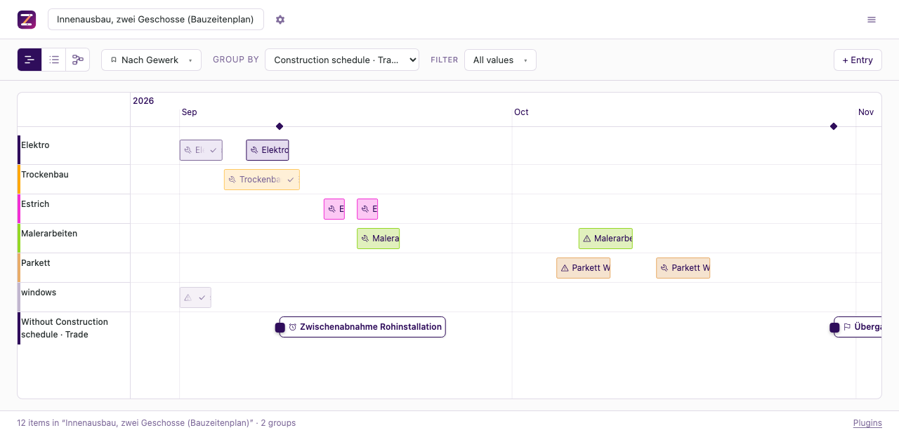

# Construction schedule

Sequences trades by the wait each one owes the next, shifts the whole chain when one
runs late, and reports the fixed dates that shift runs into. A screed that finishes a
week late moves every trade behind it by a week, and this plugin turns that into one
instruction instead of dozens of edits.

## Who is it for?

Anybody coordinating trades on a plan where the order matters and the waits are real:
a fit-out with drying times, a refurbishment handed from one trade to the next, a
programme with a handover date somebody is liable for. It plans dates and nothing else.

## What does it look like?



The example timeline is [`data/example-bauzeitenplan.json`](../../../data/example-bauzeitenplan.json),
and every state the rules distinguish is in it once.

## How do I switch it on?

Enable `dev.zeitlines.construction` on the timeline, then give it the project's trades.
A plugin's **config** has no control of its own yet
([#85](https://github.com/zeitlines/zeitlines/issues/85) closed the enabling half), so
the trades reach a timeline over MCP or as a line in the file:

```json
{
  "plugins": [
    {
      "id": "dev.zeitlines.construction",
      "config": {
        "trades": [
          { "id": "screed", "label": "Estrich", "lagDays": 28 },
          { "id": "flooring", "label": "Parkett", "lagDays": 0 }
        ]
      }
    }
  ]
}
```

Nothing is shipped as a value: there is no trade catalogue and no default wait. The
28 days above are an example, and even in the sources they are a rule of thumb whose
binding criterion is a measurement rather than a date — see the open questions.

## What are the fields?

| Field | Stored as | Type | What it holds |
| --- | --- | --- | --- |
| Trade / Gewerk | `trade` | select | which trade does this work. Options are the configured trades plus any value already on an item |
| Section / Bauabschnitt | `section` | text | the place: a floor, a flat, a riser. The unit exclusive occupancy is measured in |
| Lag (days) / Wartezeit (Tage) | `lagDays` | text | this item's own wait, overriding its trade's |
| Fixed date / Fixtermin | `fixedDate` | text | a day that does not move |
| Binding / Verbindlichkeit | `dateBinding` | select | `contract` or `control`, stored; labelled Vertragsfrist and Kontrollfrist |
| Earliest start / Frühester Beginn | `earliestStart` | computed | the earliest day the predecessors allow. Stored nowhere |

## What can my agent do with it?

| Verb | What it changes | Which rule |
| --- | --- | --- |
| `check_trade_conflicts` | nothing | exclusive occupancy, the lag on each edge, fixed dates split by binding, and everything that cannot be judged at all |
| `shift_trade_chain` | item dates | the chain shift, and the fixed dates the shifted chain can no longer meet |

`check_trade_conflicts` takes an optional `section` and `trade` to narrow the report,
and always computes over the whole timeline so a filter cannot hide half a chain.
`shift_trade_chain` takes either `item` or `trade`, plus `days`, which may be negative.
It refuses the whole plan on a cycle, holds every item carrying a fixed date, and says
what the result no longer respects.

Both are pure functions over the timeline: no clock, no I/O, and every rule behind them
has a unit test at the boundary the domain cares about.

---

# How the domain is modelled

What follows is the research this plugin was built from: the model, what is verified and
what is not, the questions it was written to answer, and the vocabulary. It is written
down rather than summarised because the open questions are the way in for anybody who
runs building programmes for a living.

## The domain model

### Entities beyond the item

| Entity | What it is | Where it lives |
| --- | --- | --- |
| Trade (Gewerk) | Who does the work: screed, drywall, electrical. A **kind of group**, never a rename of one. | `metadata.trade`, options from the plugin's config |
| Section (Bauabschnitt) | The place the work happens: a floor, a flat, a riser. Also a kind of group, and the unit exclusive occupancy is measured in. | `metadata.section` |

Both are fields rather than the core `group`, because the core group is whatever the
timeline already uses and the config has to point at something a rename cannot break.

### Rules that compute

| Rule | What it computes | Grounding |
| --- | --- | --- |
| Lag on a finish-to-start edge | Earliest start of the successor = predecessor's end + the predecessor trade's lag, in calendar days | Verified as CPM practice: a positive lag is the wait a successor owes its predecessor (drying, curing, approval) |
| Chain shift | A moved item moves every **transitive** dependent by the same number of days, along the chain rather than one link | Verified as practice; it is what „digitale Bauzeitenplaner" are sold for |
| Exclusive occupancy | Two items with the same section whose extents overlap | Plausible, not verified: whether an overlap is an error or a choice depends on the trade pair |
| Fixed date | An item carrying one does not move; a chain shift that pushes it past that date is reported rather than absorbed | Verified for VOB/B contracts, see the binding rule below |
| Binding of a date | Whether a missed date is a Verzug or only a coordination signal | Verified: VOB/B knows binding **Vertragsfristen** and mere **Kontrollfristen**; by default only Baubeginn and Gesamtfertigstellung are the former, and every Zwischenfrist in a Bauzeitenplan is the latter unless expressly agreed |

### Constraints that must hold

- A dependency cycle has no earliest start. The plugin reports it and computes nothing.
- A lag is zero or positive. A negative lag (an overlap, „lead" in CPM) is out of the
  first cut — see „What it deliberately does not do".
- A fixed date is never moved by a tool, in either direction.

### The two clocks

The planned schedule against the **agreed** one. A Bauzeitenplan is a coordination
document whose individual dates are mostly not contractual, so „late" has two
different meanings on the same bar, and only one of them has legal consequences.
That is the distinction `dateBinding` carries.

## How well is this domain modelled?

**Verified.** The lag arithmetic and the chain shift: both are ordinary CPM, and the
sources below state them in the same terms. The Vertragsfrist / Kontrollfrist
distinction, including which dates are binding by default, from a named
Fachanwalt-authored source that cites the VOB/B paragraphs.

**Plausible.** That a section holds one trade at a time. Takt planning works that way,
but whether a given overlap is a fault or normal practice depends on the two trades.

**Guessed.** Nothing is shipped as a value: no trade catalogue, no lag defaults. The
example timeline carries example values and says so.

**Open questions, for a practitioner:**

1. **Does a lag belong to the predecessor or to the pair?** The first cut says
   predecessor, overridable per item. Screed → parquet and screed → tiling plausibly
   differ, which would make the lag a property of the edge.
2. **A lag conflates two different waits.** The technological pause (the screed dries)
   and the mobilisation notice a trade needs before it can come are both days added to
   the same edge, and the sources use „Vorlaufzeit" for the second one. Modelled as one
   number here.
3. **Is a lag a number of days at all?** For screed the binding criterion is a
   measurement, not a date: Belegreife is established by CM-Messung, and the rules of
   thumb (one week per centimetre up to four, doubling per further centimetre) are
   explicitly rules of thumb. A dependency that waits for a measured condition has no
   representation here.
4. **Is a section a group or a field?** Modelled as a field. A project that plans by
   section rather than by trade would want it the other way round.
5. **Weather-dependent trades** have no representation. Neither does a lag that only
   applies in winter.
6. **The binding model is VOB/B.** A BGB-Bauvertrag or a contract outside Germany may
   draw the line elsewhere, and the plugin has no way to say which regime applies.

## Which questions does it answer?

Every question below came from a search run on **2026-08-25**, in the language it is
written in. A SERP is a measurement of one day.

**No search-volume figure.** No tool with volume data was reachable, so there is none,
and no proxy is presented as one.

| # | Question | Where it came from | What the answering pages do, and omit |
| --- | --- | --- | --- |
| 1 | „Wie erstelle ich einen Bauzeitenplan mit den Abhängigkeiten der Gewerke?" | SERP „Bauzeitenplan Gewerke Reihenfolge Vorlaufzeit erstellen" → projektpro.com, bau-master.com, cendas.net, meisterwerk.app, phase0.com | Explain the steps and hand over an Excel or Gantt template. The template is a drawing surface: nothing in it computes a dependency |
| 2 | „Was passiert mit den Folgeterminen, wenn ein Gewerk sich verzögert?" | SERP for that phrasing → exporo.de/wiki, tga-fachplaner.de, clockodo.com, architektur-online.com | Say the whole sequence shifts and that digital planners can calculate it. None states the rule, and none is a thing the reader can run |
| 3 | „Wie lange muss Estrich trocknen, bevor das nächste Gewerk kommt?" | SERP „Estrich Belegreife Trocknungszeit" → fliesen-kemmler.de, heidelbergmaterials.de (PDF), estriche-otten.de, bautrockner-verleih.de | Give the rules of thumb and name CM-Messung as the only binding method. None of them connects the answer to a schedule |
| 4 | „Sind die Termine im Bauzeitenplan verbindlich?" | SERP „Bauzeitenplan Verzug Fixtermin" → weka.de (Markus Fiedler), baunetz.de, roedl.com, gripsware.de | Answer it as law: Vertragsfrist against Kontrollfrist. The distinction never reaches the schedule; a bar in a Gantt chart cannot say which of the two it is |
| 5 | „What is the difference between lead time and lag time in a construction schedule?" | SERP „lead time vs lag time construction schedule" → coconstruct.com (2021-02-10), pmstudycircle.com, monday.com, launchnotes.com | Glossary definitions. They define, they do not compute, and none maps the lag onto a field anything reads |
| 6 | „Is there a self-hosted or open-source construction scheduling tool?" | SERP „open source self-hosted construction schedule gantt" → openproject.org, fuzen.io, blog.ganttpro.com, goodfirms.co | Name OpenProject, GanttProject, Redmine, TaskJuggler. None of them carries a trade lag as a field of its own or a verb an agent can call |

**The gap this plugin can own**, across all six: the rules are written down everywhere
as prose and nowhere as something that computes. „Der Estrich ist eine Woche zu spät,
mach den Plan neu" is one instruction with dozens of item changes behind it, and today
those changes live in whoever writes the prompt.

## Baseline

**Not recorded yet.** This session cannot reach a second model, and an invented
before-picture makes phase 6 meaningless. The exact list to run is questions 1 to 6
above, verbatim, in their own language. Record which tools each answer names, in what
order, with which words. Without it, phase 6 is skipped explicitly rather than quietly.

## Which pages the material justifies

| Intent | Page | Questions it answers |
| --- | --- | --- |
| what is X / how do I do X | the plugin's own page | 1, 2, 5 |
| how do I run a real job with this | a use case: a trade is late, recompute the plan | 2, told as the job |
| X versus Y | self-hosted construction scheduling, against the open-source tools named in 6 | 6 |
| limits, and anything true and unflattering | the FAQ on the plugin page | 3, 4 |

**Language decision:** four of the six questions are German and the site is English. The
pages are written in English and name the German terms where they are the search term
(Bauzeitenplan, Gewerk, Vertragsfrist, Belegreife), so a German searcher's word appears
on the page. No German page is planned.

## Terminology

| Our word | The common word | Used where |
| --- | --- | --- |
| Lag | Lag (EN, CPM), Zeitabstand (MS Project DE), Wartezeit (DE practice) | field label, README, page |
| Trade | Trade (EN), Gewerk (DE) | field label, README, page |
| Section | Section (EN), Bauabschnitt (DE) | field label, README |
| Fixed date | Fixtermin (DE) | field label |
| Binding | Vertragsfrist / Kontrollfrist (DE, VOB/B) | field label, option labels |

**The correction this table exists for:** issue #135 calls the wait a „lead time". In
CPM a **lead** is the opposite — a negative lag, letting a successor start before its
predecessor finishes. Shipping a field labelled „Lead time" that adds days would be
wrong in the vocabulary of every person the plugin is for.

**Core vocabulary is untouched.** A Gewerk is a kind of group, a Bauabschnitt is a kind
of group, a Fixtermin is an item with a rule attached. Item, group, phase, dependency,
status and version keep their names.

## Claims and sources

Statements about other products carry a source and a read date, and the read date for
every source below is **2026-08-25**. No numbers are invented. The confidence statement
above is the binding version of how well this domain is modelled; nothing written for
the site may contradict it.

### Sources

- Bauzeitenplan, structure and dependencies: projektpro.com, bau-master.com,
  cendas.net, meisterwerk.app, phase0.com
- Delay and its effect on following trades: exporo.de/wiki, tga-fachplaner.de,
  clockodo.com, architektur-online.com
- Screed drying and Belegreife, including CM-Messung: fliesen-kemmler.de,
  heidelbergmaterials.de, estriche-otten.de, bautrockner-verleih.de
- Vertragsfristen against Kontrollfristen under VOB/B: weka.de, article by Markus
  Fiedler (Fachanwalt für Bau- und Architektenrecht); baunetz.de; roedl.com
- Lead against lag: coconstruct.com (published 2021-02-10), pmstudycircle.com,
  monday.com
- Positive and negative lags as a schedule defect: rolandwanner.ch
- Self-hosted and open-source scheduling tools: openproject.org, fuzen.io,
  blog.ganttpro.com, goodfirms.co

---

# The specification, as built

Plugin id `dev.zeitlines.construction`, folder `src/plugins/construction/`,
`apiVersion: "^1.7"`. Every step of that floor is load-bearing: `^1.3` for `tools`,
`^1.5` for the one `derived` field, `^1.6` for the calendar-day arithmetic this plugin
takes from the contract rather than restating, `^1.7` for `pluginMessages`.

## Fields

Five stored, one computed. The stored five are the plugin's `metadataKeys`, so an
uninstall cleans them off every item; `earliestStart` is deliberately absent from that
list, because nothing is ever written under it.

| Key | Label (EN / DE) | Type | Where the options come from |
| --- | --- | --- | --- |
| `trade` | Trade / Gewerk | `select` | The config's trade ids, **plus every value already present on an item** |
| `section` | Section / Bauabschnitt | `text` | — |
| `lagDays` | Lag (days) / Wartezeit (Tage) | `text` | — |
| `fixedDate` | Fixed date / Fixtermin | `text`, `YYYY-MM-DD` | — |
| `dateBinding` | Binding / Verbindlichkeit | `select` | Fixed: `contract`, `control` |
| `earliestStart` | Earliest start / Frühester Beginn | `text`, `derived: true` | computed, stored nowhere |

**Why `trade`'s options include the values already on items.** A select renders only
what it offers, so dropping a trade from the config would leave every item carrying it
with an empty control over stored data — the value still in `metadata`, invisible and
one save away from being lost. The union keeps a retired trade visible and lets
`check_trade_conflicts` report it as unknown to the config, which is the truthful
answer rather than a silent one.

**Every date and number field is `text`, and that is a limit rather than a choice.**
`CustomFieldType` is `text | select | multi-select`: no date type and no number type. So
the form offers no picker, and this plugin parses strictly and refuses in its own rule
module. A lenient parser here would read „01.05.2026" as an American date and place a
computed start months from where the author meant it, with nothing on screen saying so.

**Stored values are never translated.** `contract` and `control` are ids in item
metadata; only their labels move between languages („Vertragsfrist", „Kontrollfrist").
A trade's `label` in the config is the project's own word for its Gewerk and is a value
too, so it is rendered as given rather than looked up.

## Config

```json
{
  "trades": [
    { "id": "screed", "label": "Estrich", "lagDays": 28 },
    { "id": "flooring", "label": "Parkett", "lagDays": 0 }
  ]
}
```

`trades` is an array of `{ id, label, lagDays }`, all three required. `id` is the value
stored in `metadata.trade` and is therefore constrained to a shape that survives being
a grouping key. `lagDays` is an integer of at least zero.

**No `default` anywhere, and `lagDays` is required rather than defaulted to zero.** A
missing lag defaulted to zero would be this plugin asserting „no wait between these two
trades", which is a domain claim about somebody's building. The verbs report that they
cannot judge an item instead.

## Agent tools

| Verb | What it changes | Which rule |
| --- | --- | --- |
| `check_trade_conflicts` | Nothing | Exclusive occupancy, lag on the edge, fixed dates and their binding, and what cannot be judged at all |
| `shift_trade_chain` | Item dates | Chain shift, and the fixed dates that a shift runs into |

### `check_trade_conflicts`

Arguments `section` and `trade`, both optional; absent means every item. Reports, and
changes nothing:

1. **Two items sharing a section whose extents overlap.** End-to-start touching is not
   an overlap.
2. **A successor starting before its predecessor's end plus the applicable lag**, per
   `dependsOn` edge. The applicable lag is the item's own `lagDays` where it carries
   one, otherwise the lag of its trade in the config.
3. **A fixed date the current plan already passes**, naming the binding: a
   `contract` date and a `control` date have different consequences and are reported
   as different findings rather than one list.
4. **What cannot be judged**: an item whose trade the config does not know, an
   unparsable lag or fixed date, an item with no dates at all. Named explicitly, so
   silence is not read as „nothing wrong here".
5. **A cycle in `dependsOn`**, reported rather than followed.

Ranks nothing. Which overlap is acceptable depends on the two trades, and that is not
in the timeline.

### `shift_trade_chain`

Arguments: exactly one of `item` (an id) or `trade` (a trade id), plus `days`, an
integer that may be negative. Moves the seed and **every transitive dependent** by the
same number of days, along the chain rather than one link.

- An item carrying a `fixedDate` **is not moved.** It stays where it is, the chain runs
  into it, and the answer names how the plan now sits against that date and under which
  binding. A verb that silently moved a Vertragsfrist would be able to make a late plan
  look on time.
- A **negative** `days` pulls items earlier, which can put a successor before its
  predecessor's end plus lag. Reported, not silently accepted.
- A cycle in `dependsOn` refuses the whole plan with the reason. A plan is one rule's
  answer, and half of it applied leaves the timeline in a state the rule never
  described.
- An item with a `duration` and no `end` has only its `start` moved, so its extent is
  preserved rather than recomputed.
- `days: 0` changes nothing and says so.

**Renamed from #135's `shift_trade_with_lead_time`** for the reason in 1.6: what it
adds is a lag, and „lead" means the opposite in the vocabulary of everybody who would
call it.

## View

None. A trade and a section are both kinds of group, so grouping by either renders the
schedule already, and a view is roughly ten times the work of the rule that makes it
worth having.

## Data

Item metadata and the config bag. **No collections**, so no `public:read` and no
`"public": true` on the example's plugin entry: `stripFileForPublication` strips rows,
and this plugin has none. Declaring a publication consent with nothing behind it would
be a claim about data that does not exist.

## Catalogue entry

- **Name:** Construction schedule
- **Summary:** Sequences trades by the wait each one owes the next, shifts the whole
  chain when one runs late, and reports the fixed dates that shift runs into.
- **Domain:** `construction`
- **Keywords:** bauzeitenplan, construction schedule, gewerke, trades, lag time,
  zeitabstand, wartezeit, bauablaufplan, bauabschnitt, chain shift, vertragsfrist,
  kontrollfrist, fixed date, self-hosted construction schedule
- **Example:** `src:example-bauzeitenplan`

## What it deliberately does not do

- **Quantities, costs and crew sizes.** This plans dates. A schedule that also wants to
  be a calculation ends up being neither.
- **Negative lag, that is an overlap.** It would need a start-to-start relation the core
  has no representation for, and the practice literature treats routine positive and
  negative lags as a schedule defect rather than a feature.
- **A trade catalogue with lag values.** No shipped domain values, for the reason in
  „No fallback data, ever": a stale lag table is indistinguishable from a verified one.
  The example timeline carries example values and says so.
- **Deciding who gets the section.** Where two trades want the same place at the same
  time the plugin reports it. Which of them yields is the site manager's call.
- **Critical path and float.** Generic CPM, and if it belongs anywhere it belongs to the
  core rather than to one domain's plugin.
- **Weather.** Named as an open question instead, because a weather-dependent lag is a
  different model rather than a value.
- **Any statement about legal consequences.** The plugin carries the VOB/B distinction
  as data and reports which side of it a date sits on. It gives no advice.

## How do I improve this plugin?

The six open questions above are the concrete way in, and three of them need somebody
who has run a building programme rather than somebody who can write TypeScript:

- **Does the wait belong to the predecessor or to the pair?** Screed → parquet and
  screed → tiling plausibly differ. One sentence from a practitioner decides whether
  this stays a property of the trade.
- **Is it a number of days at all?** Belegreife is established by CM-Messung, not by a
  calendar. A dependency that waits for a measured condition has no representation
  here, and it may be the more honest model.
- **Is an overlap in one section a fault or normal practice?** It depends on the two
  trades, and the plugin currently reports every one of them.

Answers, corrections and disagreement go to the tracker
(<https://github.com/zeitlines/zeitlines/issues>); the contribution guide is
[`CONTRIBUTING.md`](../../../CONTRIBUTING.md). The conventions for changing this folder
are in [`AGENTS.md`](AGENTS.md).
